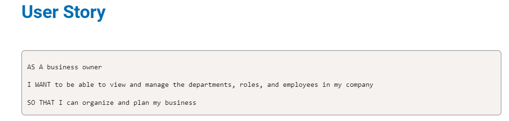
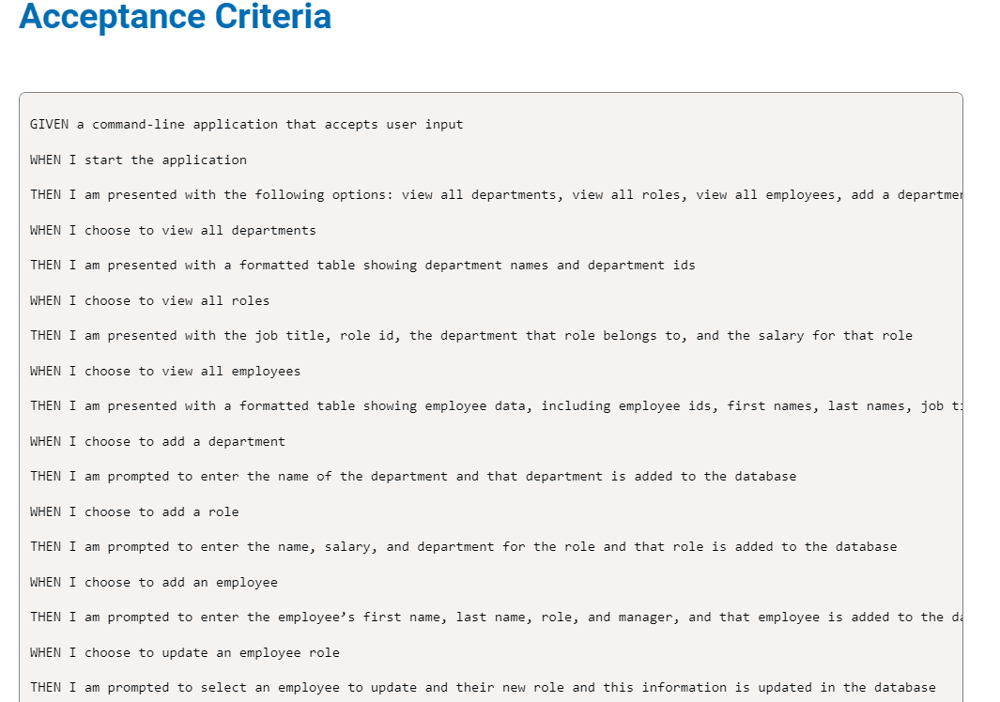

# SQL-employee-tracker
challenge 12

## Description
The Employee Tracker Application is a command-line interface (CLI) program built with Node.js and PostgreSQL. It allows users to manage departments, roles, and employees within an organization.

## Features
- View all departments, roles, and employees
- Add new departments, roles, and employees
- Update employee roles
- Delete departments, roles, and employees
- View employees by department
- View department budget

## Installation
1. Clone the repository to your local machine.
2. Install Node.js and npm if you haven't already.
3. Install PostgreSQL and create a database named `employeetracker_db`.
4. Run the SQL scripts in `schema.sql` and `seeds.sql` to create the database schema and seed initial data.
5. Update the database connection settings in `index.js` if necessary.
6. Open a terminal and navigate to the project directory.
7. Run `npm install` to install the project dependencies.

## Usage
1. Start the application by running `npm start` in the terminal.
2. Follow the prompts to perform various actions such as viewing, adding, updating, or deleting departments, roles, and employees.
3. Use the arrow keys to select options from the main menu and input fields to provide information when prompted.

## Dependencies
- [inquirer](https://www.npmjs.com/package/inquirer): For prompting user input in the command-line interface.
- [pg](https://www.npmjs.com/package/pg): PostgreSQL client for Node.js.

## Contributing
Contributions are welcome! If you find any bugs or have suggestions for improvements, please open an issue or submit a pull request.

## License
This project is licensed under the MIT License. See the [LICENSE](LICENSE) file for details.

## Resources
xpert, activites from previous classes

## links
-https://icecreamapps.com/v/b9g9c23 part 1

-https://icecreamapps.com/v/gtm5vkg part 2